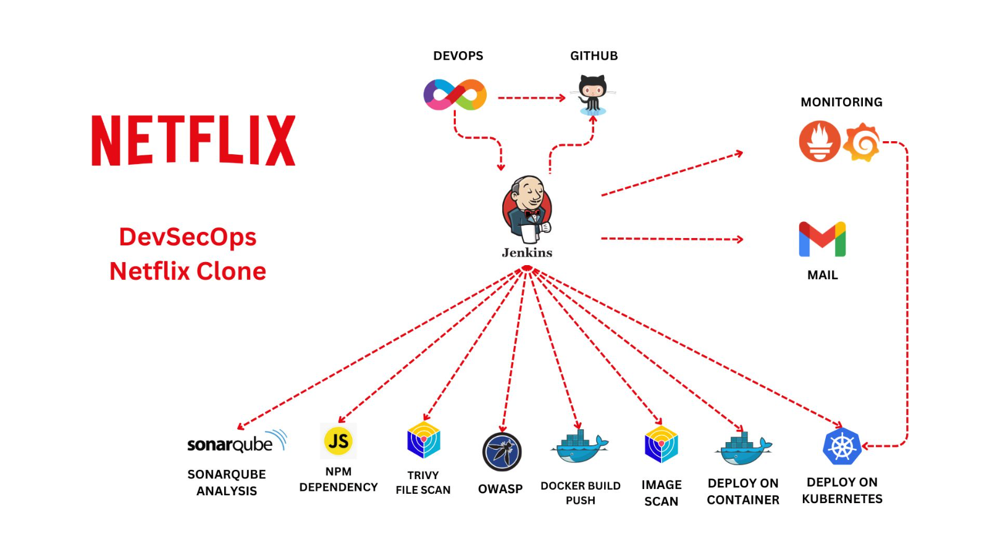

# 🎬 DevSecOps Netflix Clone – CI/CD, Security & Monitoring on AWS

This project implements a full **DevSecOps pipeline** to deploy a **Netflix Clone** on AWS EC2, featuring:

- ✅ CI/CD automation with **Jenkins**
- 🔐 Security analysis using **Trivy** and **OWASP Dependency Check**
- 📦 **NPM dependency scanning**
- 📊 Monitoring with **Prometheus**, **Node Exporter**, and **Grafana**
- ☸️ **Docker & Kubernetes** deployment
- 📧 **Email notifications** via Jenkins

---

## 🚀 Project Goals

- Build a **secure CI/CD pipeline** from scratch  
- Integrate **DevSecOps open-source tools**  
- Implement **real-time monitoring & alerts**  
- Deploy a **scalable app using Kubernetes**  
- Apply **security best practices** on cloud infrastructure  

---

## 🛠️ Tech Stack

| Category         | Tools & Technologies                            |
|------------------|-------------------------------------------------|
| **CI/CD**        | Jenkins, GitHub                                 |
| **Security**     | Trivy, OWASP Dependency Check, NPM Audit        |
| **Code Analysis**| SonarQube                                       |
| **Containerization** | Docker                                      |
| **Orchestration**| Kubernetes (Kubeadm, kubectl)                   |
| **Monitoring**   | Prometheus, Node Exporter, Grafana              |
| **Cloud**        | AWS EC2, Security Groups                        |
| **Notification** | Jenkins Email Extension (Gmail SMTP)            |

---

## 🧱 Architecture

📌 *Netflix DevSecOps Architecture Overview*

---

## 📦 Project Workflow

### 🔹 Phase 1: Infrastructure Setup
- Launch **3 EC2 instances**:
  - Jenkins
  - Kubernetes Master
  - Kubernetes Worker
- Install required tools:
  - Jenkins, Docker, SonarQube, Trivy, Grafana, Prometheus

### 🔹 Phase 2: CI/CD Pipeline + Security
- Create a full **Jenkins Declarative Pipeline**
- Code analysis with **SonarQube**
- Dependency scanning with **OWASP & NPM**
- Trivy **FS** & **image vulnerability scans**
- **DockerHub** integration

### 🔹 Phase 3: Deployment
- Container-level deployment (**Docker**)
- Cluster-level deployment (**Kubernetes**)
- Configure **Node Exporter** on each K8s node

### 🔹 Phase 4: Monitoring & Alerting
- **Prometheus** scrapes Jenkins & Node metrics
- **Grafana dashboards** for Jenkins & system metrics
- **Email notifications** setup via Gmail SMTP

---

## 🛠 Jenkins CI/CD Pipeline

- ✔️ **Git checkout**  
- ✔️ **SonarQube Analysis + Quality Gate**  
- ✔️ **OWASP Dependency Check**  
- ✔️ **Trivy FS & Image Scan**  
- ✔️ **Docker Build & Push**  
- ✔️ **Deploy to Docker**  
- ✔️ **Deploy to Kubernetes**  
- ✔️ **Monitoring & Email Notification**

---

## 📁 Application Source Code

This repository is directly cloned and used in the Jenkins CI/CD pipeline for:

- 🏗️ **Building the Docker image**  
- 🧪 **Running SonarQube code analysis**  
- 🔐 **Trivy and OWASP security scans**  
- 🚀 **Deployment on Docker and Kubernetes clusters**

---

## 🔗 Netflix Clone – Frontend Repository

This repository includes:

- 🎬 The **React + TypeScript Netflix Clone** frontend  
- 🐳 A **Dockerfile** to containerize the application  
- ☸️ **Kubernetes manifests** (`Kubernetes/`) for deployment  
- 📂 Source code under `src/` and UI components in `public/`  
